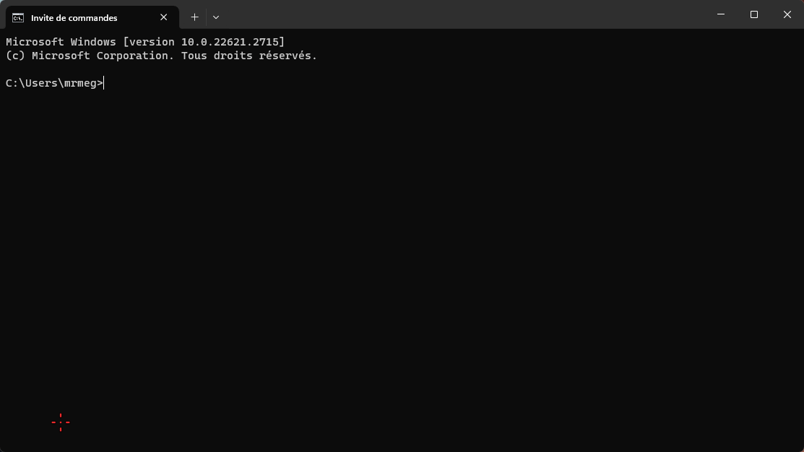
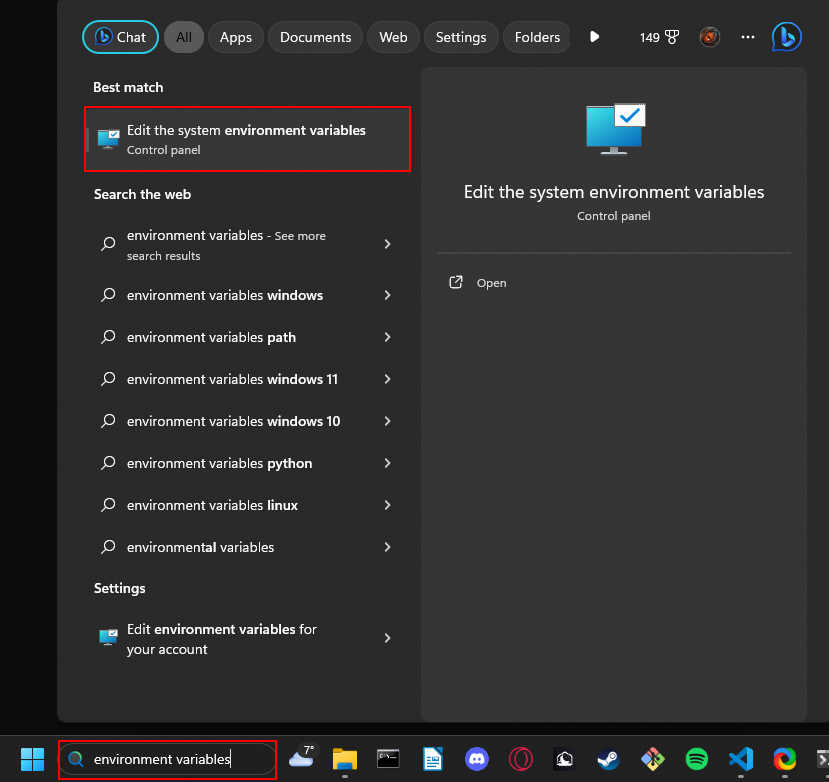
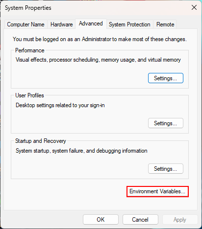
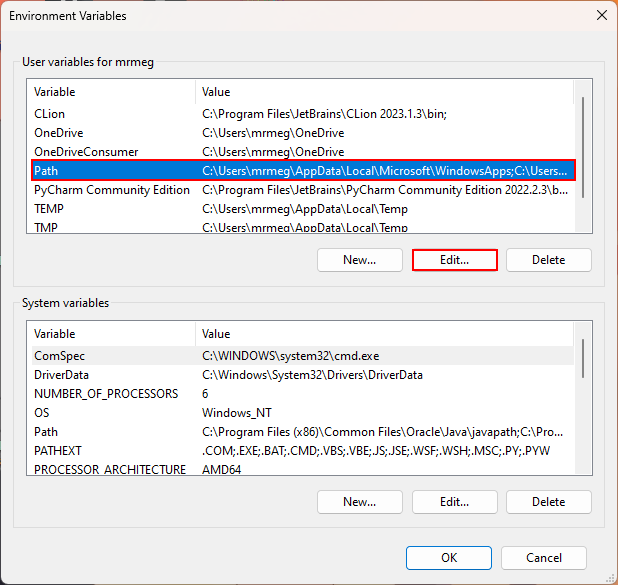
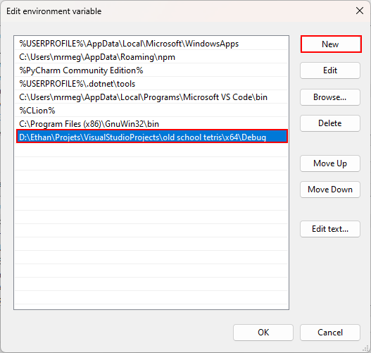

# The old-school Tetris

## Info

This is a public project, you can participate and distribute it in compliance with the LICENSE.txt (the "license").

## Presentation

Waiting between 2 games of Fortnite, Minecraft... Or just want to play Tetris like a pro ? This old-school Tetris game may interest you. You can play it on the command prompt by tapping a command (tutorial below) or simply use the shortcut on your desktop.

## Control

> Move with the right, left and down arrow

> Turn the piece with the up arrow

> Pause the game with entry

> Exit the game with ctrl + return

## Score

> fitted piece = 10 points

> 1 broken line = 100 points

> 2 broken lines = 300 points

> 3 broken lines = 500 points

> 4 broken lines (tetris) = 1000 points
## Parameters

### How to set up the "tetris" command

To set up the "tetris" command as I did on the presentation gif, simply set the path to the tetris directory in the PATH environment variable. For those who don't know the trick, here's a short tutorial.

1. **First, search edit Environment variable in the Windows panel.**

---
2. **Next, click on Environment variables.**

---
3. **Then, double click on Path.**

---
4. **Then, click on New and paste the path to the directory where the executable is stored. 
In my case it's Debug.**

---
5. **Congragulation ! You've got tetris in your PATH, now you can use it as a command in the command prompt.**